# Finite Possibility Mechanics

## A Plain-Language Introduction

This document explains a model of the universe called **Finite Possibility Mechanics**.

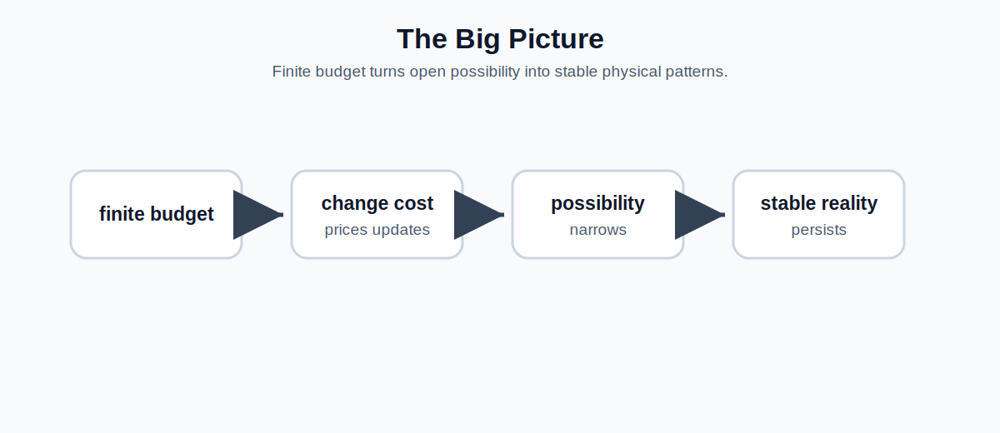

The goal is not to sound complicated. The goal is to explain the idea clearly enough that a curious teenager could follow it, argue with it, and build on it.

This model starts with one basic question:

> What if the universe is not made of things first, but of possibilities that cost energy to keep open?

In normal life, we already understand this idea.

If you have unlimited time, unlimited energy, and unlimited memory, you can keep every option open forever. You can think about every possible choice, simulate every possible future, and never commit.

But real systems are not like that.

They have limits.

They have only so much energy.  
They have only so much memory.  
They can only update one moment at a time.

Finite Possibility Mechanics says the universe works the same way.

The universe is a finite system. Because it is finite, it cannot keep every possibility open forever. Open possibilities eventually get compressed into stable patterns.

That simple pressure may be the root of what we experience as matter, time, gravity, light, memory, and reality itself.

---

## 1. The Core Picture

Finite Possibility Mechanics says reality is not made of separate "stuff" first.

It is made of one connected system that keeps updating itself.

You can imagine this system like a giant invisible grid. Every point on the grid is a tiny **update point**.

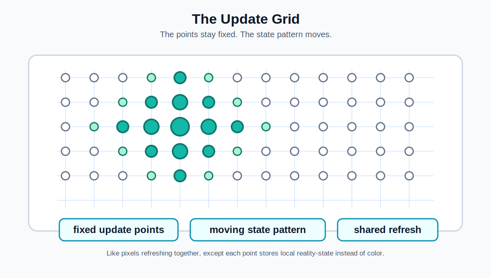

An update point is:

> A tiny part of reality whose next state depends on its local situation, its available energy, and the cost of changing.

It is not a creature.  
It is not a robot.  
It is not a little person thinking.

It is more like one pixel in a screen, except instead of storing color, it stores the local state of reality.

The update points do not fly around. They stay where they are. What moves is the pattern passing through them.

Think of a stadium wave. The people stay in their seats, but the wave moves around the stadium.

In this model, particles are like that wave.

The grid is the map.  
The update points are the pixels.  
Particles are moving patterns in those pixels.  
Matter is a pattern that has become stable and expensive to change.

In this picture, the update points should be imagined as updating together, not one at a time in a line. Each moment is like a full-frame refresh. Every point reads the previous frame, then the next frame appears.

That matters because it prevents a confusing problem. If one point updated early and its neighbor updated late, the result would depend on update order. This model needs each moment to be a shared update across the whole system.

---

## 2. What Actually Moves?

The phrase "moving through space" can be confusing because it sounds like tiny objects are driving down roads.

That is not what this model means.

Nothing solid is being shipped through space like a package.

What moves is **state**.

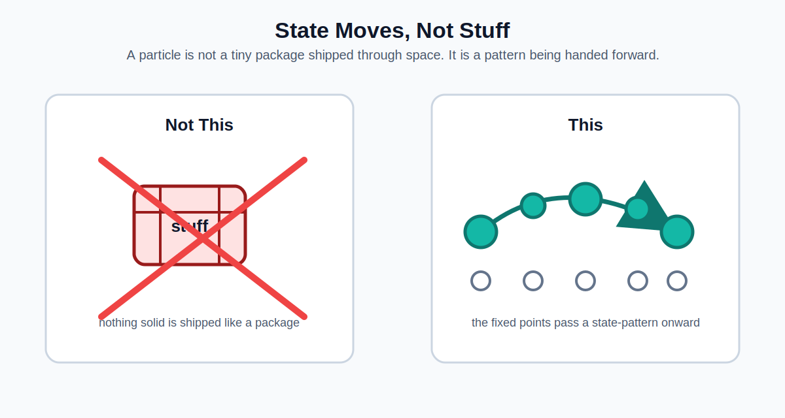

State means the current answer to questions like:

> What pattern is here?  
> How certain is it?  
> How much energy does it have?  
> Is it still flexible, or has it become memory?

When a photon moves, one update point does not throw a tiny ball to the next update point. Instead, the first point stops holding the photon-pattern, and the next point starts holding it.

That handoff is motion.

This is why the model says:

> Motion is not stuff sliding through emptiness. Motion is a pattern being rewritten across the grid.

This also helps explain why there is a speed limit. A pattern can only be handed from one update point to the next as fast as the universe updates.

---

## 3. The Universe Has a Budget

The first rule is:

> Every possibility costs something to maintain.

A possibility is not free. If the universe keeps multiple outcomes open, it has to spend energy tracking them.

Imagine trying to play a video game where the computer must calculate every possible move every player could make, forever. Very quickly, the computer would run out of memory or processing power.

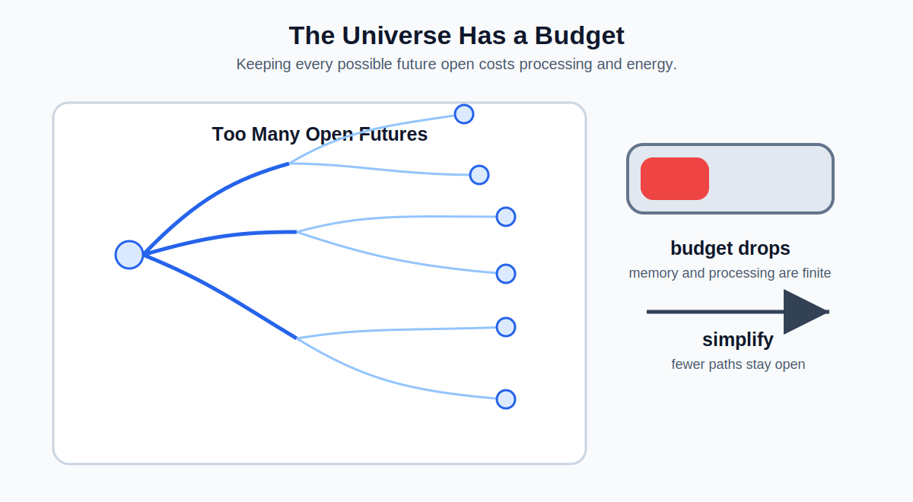

So the system simplifies.

It asks:

> Which possibilities remain open, and which ones become stable memory?

This is the heart of the model.

Reality is not just what exists. Reality is what remains affordable.

Another way to say this is:

> Every possible next state has a change cost. Lower-cost changes are more likely to persist.

Change cost is the price of updating from what reality is now into what reality becomes next.

---

## 4. Information Is Not Free

The phrase "possibility costs energy" is not meant as poetry.

There is a real physical idea behind it:

> Changing, recording, copying, correcting, or erasing information has a physical price.

In physics and computing, this is related to **Landauer's principle**. The simple version is that erasing information is not free. It produces heat. It spends energy.

You do not need the equation yet. The important point is simple:

> Information has to be carried by something physical.

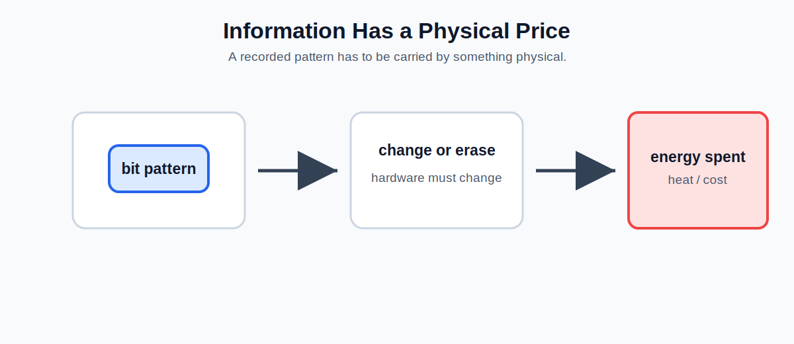

On a computer, a saved photo is not magic. It is a real pattern in real hardware. Changing it, copying it, or deleting it means the hardware has to physically change.

Those changes may be tiny, but they are not nothing.

Finite Possibility Mechanics extends that intuition into a bigger picture.

If the universe keeps many outcomes open, it has to maintain information about all those possible outcomes.

If the universe records one definite outcome, that record also costs something.

If a pattern expects the wrong next state, correcting the mismatch costs something.

So information is not a ghostly, weightless idea floating above physics.

In this model:

> Information is part of the physical budget.

That is why possibility cannot stay open forever for free.

---

## 5. One Rule Behind Many Effects

A key idea of this model is:

> One kind of cost can show up as many different physical effects.

In this plain version, we call that cost **change cost**.

Change cost is the price of updating from one state to another.

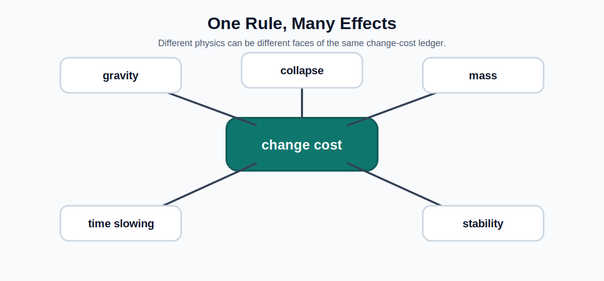

The same basic idea appears again and again:

1. **Collapse:** Open possibility becomes too expensive, so the pattern narrows into one recorded result.
2. **Matter:** A stable pattern is cheaper to repeat than to recalculate, but it can become hard to change.
3. **Gravity:** Motion bends because some nearby changes cost less than others.
4. **Time slowing:** Heavy or difficult regions process fewer local changes.
5. **Decay:** Expensive unstable patterns eventually fail to maintain themselves.
6. **Life:** Living systems survive by taking in more usable energy than they spend maintaining their pattern.

This is why the model is not a collection of separate explanations.

It is one accounting idea wearing different masks.

> Different physics may be different faces of the same change-cost ledger.

---

## 6. The Four Things Every Update Point Tracks

To keep the model simple, imagine every update point tracks four basic things.

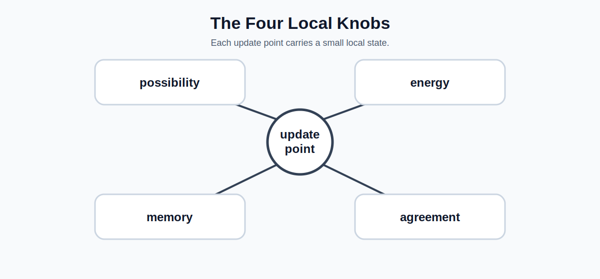

**Possibility:** How many outcomes are still open?

If possibility is high, the pattern is flexible. It has not fully committed yet. This is the world of uncertainty, waves, and "maybe."

**Energy:** How much freedom does the pattern have?

If energy is high, the pattern can afford to explore. If energy is low, the pattern has to simplify.

**Memory:** How strongly does the pattern repeat the past?

If memory is low, the pattern can change easily. If memory is high, the pattern repeats a familiar state.

**Agreement:** How well does the pattern match nearby patterns?

If nearby update points agree, the pattern is easier to maintain. If nearby update points disagree, the system has to spend energy resolving the mismatch.

These four things create the basic pressure of the model:

> Possibility stays open when there is enough budget, but stable memory takes over when possibility becomes too expensive.

---

## 7. Possibility vs. Memory

When a system has plenty of energy, it can explore.

It can stay flexible.  
It can hold uncertainty.  
It can keep different futures open.

But when energy gets low, the system cannot afford all that openness anymore.

So it settles into memory.

In this model, memory means a stable pattern that repeats cheaply. It does not mean the universe has a mind or remembers things like a person. It means the past has left a structure that is easier to keep using than to rebuild from scratch.

This gives us a simple rule:

> When possibility becomes too expensive, it hardens into memory.

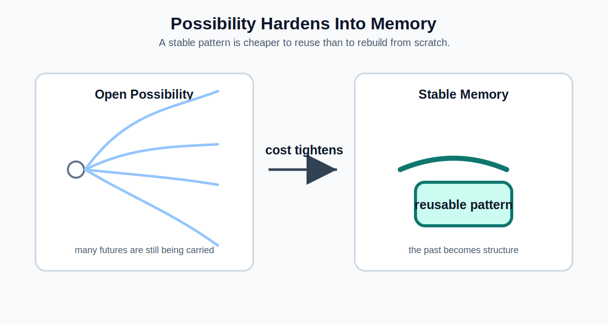

This may be the deeper meaning of physical matter.

Matter is not treated as a magical substance. Matter is treated as stable, compressed information. It is what possibility becomes when openness becomes too expensive to maintain.

That does not mean a planet is a file on a computer somewhere.

It means something deeper:

> A planet is a stable pattern in the universe's own update system.

There is no extra physical stuff underneath the pattern. In this model, the pattern is the physical thing.

---

## 8. The Collapse Loop

The model needs one more piece before matter makes sense.

It is not enough to say:

> Possibility becomes memory.

We need to explain how that happens.

Here is the plain-language loop:

1. A pattern has many possible futures open.
2. Keeping those futures open costs energy.
3. As the local budget drops, the pattern cannot afford as much openness.
4. The pattern settles into a more familiar stable state.
5. Once it settles, there is less uncertainty to maintain.
6. With less uncertainty, the pattern becomes even harder to change.
7. The stable state reinforces itself.

This is the **collapse loop**.

A simple analogy is a phone with a dying battery. When the battery is full, the phone can keep many apps running, refresh the screen constantly, and search for signals. When the battery gets low, it shuts things down, reduces activity, and falls back to simpler modes.

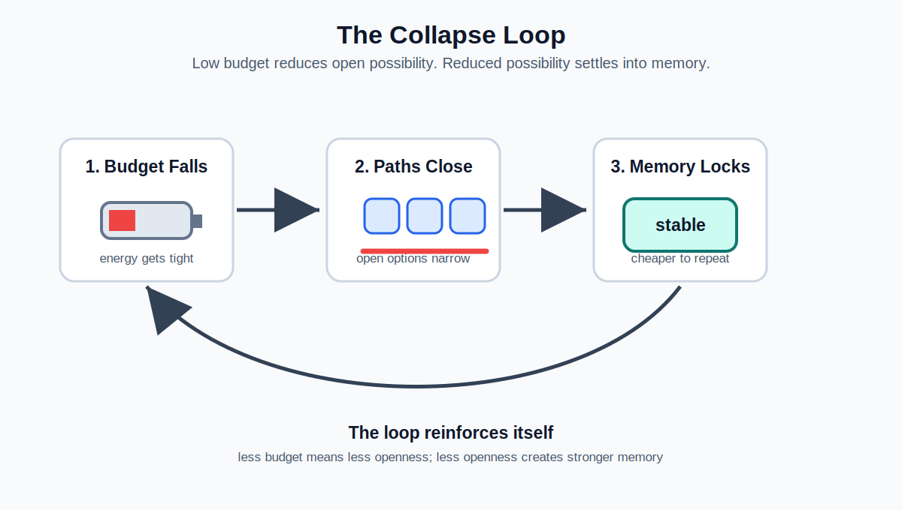

The phone is not making a philosophical decision. It is obeying a budget.

Finite Possibility Mechanics says physical reality may do something similar:

> When open possibility becomes too expensive, the system narrows, records, and stabilizes.

This is how a flexible possibility can become a definite event.

---

## 9. Why Matter Feels Solid

If matter is a stable pattern, an obvious question appears:

> Why can't my hand pass through a table?

In this model, matter feels solid because stable patterns resist being overwritten by other stable patterns.

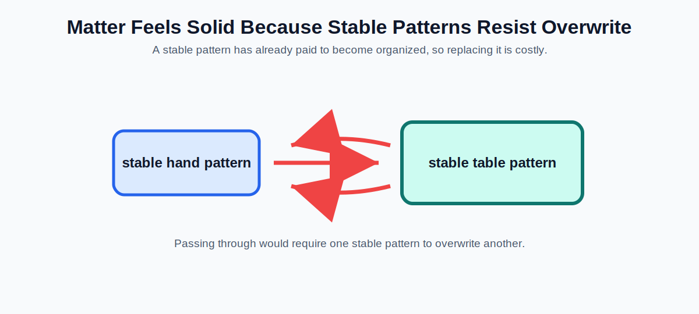

Your hand is not one simple thing. It is a huge organized pattern. The table is also a huge organized pattern.

For your hand to pass through the table, the update points in the same region would have to hold two incompatible stable patterns at once. That is not cheap. It would require the local system to rewrite both patterns without breaking their structure.

So the patterns push back.

Solidity is not magic. It is resistance to being overwritten.

This gives us another simple rule:

> Solid matter is stable information defending its shape.

---

## 10. Mass as Pattern Cost

If matter is stable information, then another question appears:

> Why are some things heavier than others?

In this model, mass is not treated as a magical substance added on top of matter.

Mass is the cost of holding a pattern together.

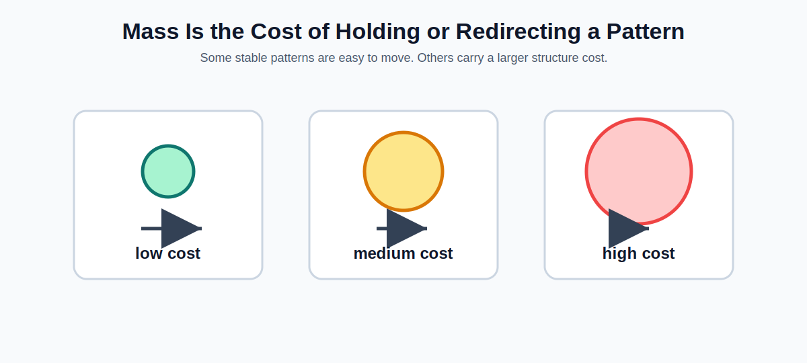

Some patterns are simple. They are easy to move, easy to pass along, and cheap to maintain.

Other patterns are more locked, more structured, and harder to change. They require more update points to stay coordinated. They resist being moved or rewritten.

That resistance appears as mass.

A plain way to say it is:

> Mass is pattern-cost made physical.

This does not mean a heavy object is "more real" than a light one. It means the heavy object is a more expensive stable pattern to maintain and redirect.

Light is cheap motion.

Matter is stable pattern.

Mass is the cost of that stability.

---

## 11. Why Matter Forms Layers

Matter is not just solid. It is structured.

Atoms have shells. Materials have layers. Molecules fold. Crystals arrange themselves into repeating shapes.

Finite Possibility Mechanics explains this through cost and crowding.

A stable center can make nearby changes cheaper, so patterns gather around it.

But they cannot all occupy the same exact local state. If too many patterns try to crowd into the same region, they interfere, mismatch, and raise the cost.

So matter forms layers.

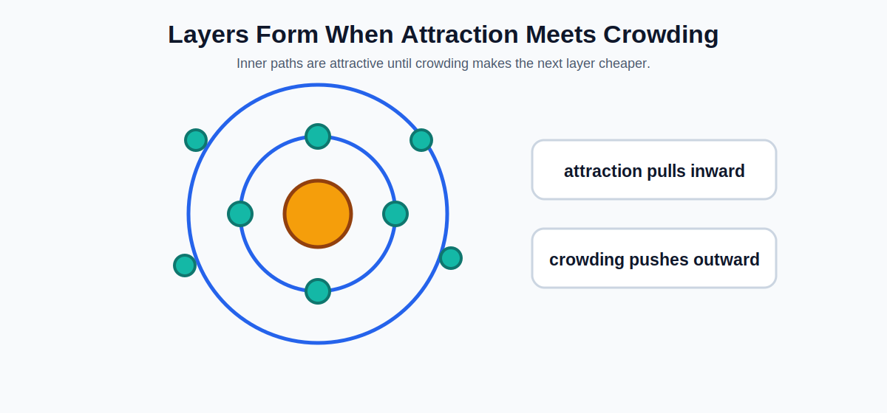

The first layer fills because it is cheap.

Once that layer becomes crowded, adding more structure there becomes expensive.

The next available layer becomes the better option.

This gives a simple picture:

> Matter forms shells and layers because attraction, crowding, and change cost must balance.

This is not yet the full explanation of chemistry. It is the beginner-level shape of the idea.

Stable matter is not a pile.

Stable matter is organized cost.

---

## 12. Why Wrong Expectations Cost Energy

There is another important idea:

> A pattern that expects the wrong thing has to keep correcting itself.

Correction costs energy.

Imagine walking through your house in the dark. If you know where the furniture is, you move smoothly. But if you expect a chair to be somewhere else, you bump into things, stop, adjust, and spend extra effort correcting your path.

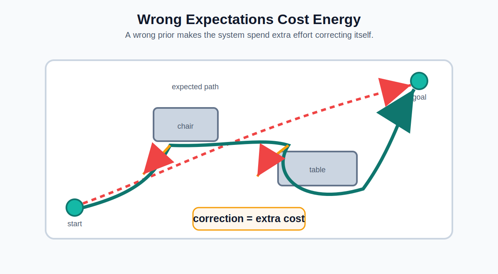

The same idea applies here.

An update point does not have a mind, but it can still carry a local expectation. It can be more prepared for one kind of next state than another.

If that expectation matches the nearby pattern, the next update is cheaper.

If that expectation clashes with the nearby pattern, the system has to spend energy resolving the mismatch.

So in this model:

> Wrong expectations are physically expensive.

This matters because stable reality is not only about energy. It is also about agreement. A pattern that agrees with its surroundings is easier to maintain. A pattern that constantly disagrees with its surroundings burns budget correcting itself.

---

## 13. Cheap Does Not Always Mean Light

There is an important detail here.

Stable memory can be cheap to reuse, but that does not mean all stable patterns are light.

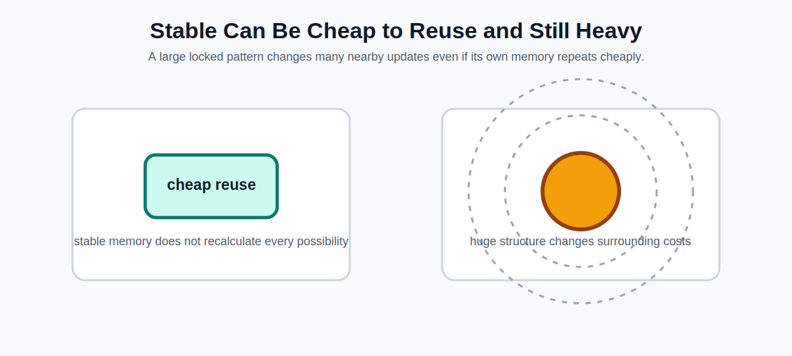

Matter is cheaper than open possibility because it is stable. A stable pattern does not need to recalculate every possible version of itself at every moment.

But a huge matter-pattern, like a planet, still matters enormously because it locks many update points into one organized structure.

That locked structure changes the cost of nearby changes.

So there is no contradiction:

1. Matter is cheaper than open possibility because it is stable.
2. Large matter-patterns are still heavy because they lock many update points into a persistent structure.
3. That persistent structure changes how nearby motion behaves.

This is why a planet can be both stable and massive.

Stable does not mean weightless. Stable means the pattern has become hard to change.

---

## 14. Light Is the Cheapest Motion

> Light is the cheapest kind of moving information.

Light does not sit still as heavy memory. It moves. It is a clean, low-cost pattern that can be passed from one part of the universe to the next.

In this model, empty space is not truly empty. It is more like a network of tiny update points passing information around.

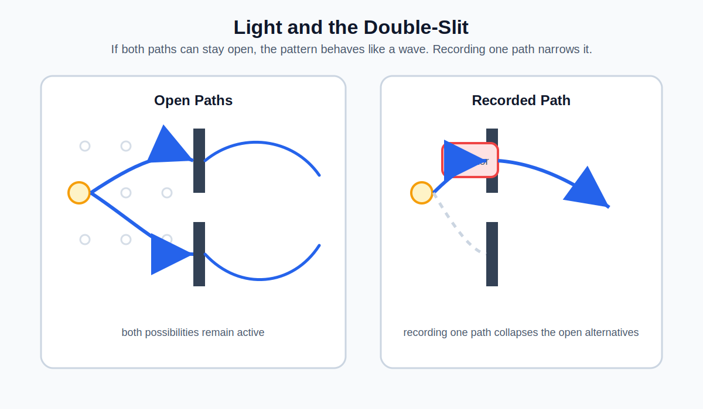

Light moves through this network at the maximum possible speed because it follows the cheapest available change from one update point to the next.

That gives us a simple picture:

> The speed of light is the speed limit of the universe's update network.

Nothing can move faster than the system can pass information from one update point to the next.

### The Life of One Photon

Here is the simple version of a light particle moving through the universe:

1. **Birth:** A stable pattern, such as an atom, releases energy.
2. **Formatting:** That energy becomes a very cheap moving pattern: light.
3. **Travel:** Each update point hands the light-pattern to a neighbor.
4. **Spread:** If the path is uncertain, the pattern can stay partly open across several possible paths.
5. **Hit:** When it reaches matter, the pattern interacts with a stable memory structure.
6. **Absorption or reflection:** The matter-pattern either takes in the energy or sends a new light-pattern away.

So a photon is not a marble flying through a void.

It is a cheap, fast, transferable pattern moving through the update network.

---

## 15. The Double-Slit Experiment

The double-slit experiment is a famous physics experiment where a particle seems to act like a wave when no interaction records which slit it went through.

Finite Possibility Mechanics explains it through cost.

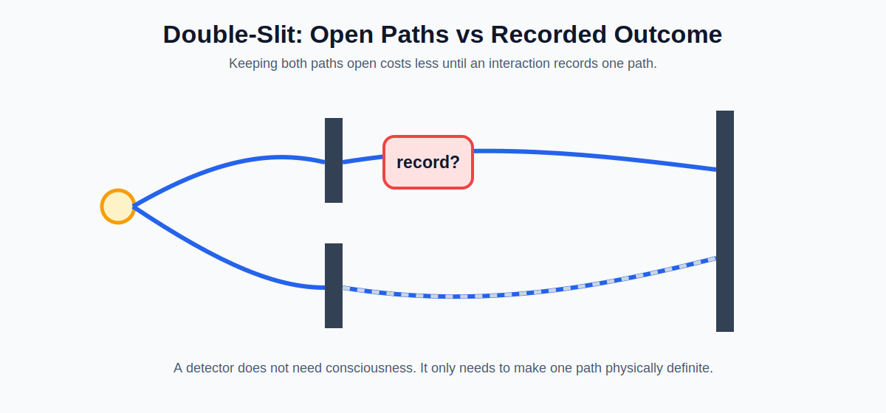

If the universe can afford to keep both paths open, the particle behaves like a wave. It keeps more than one possible path active, and those possibilities can interfere with each other.

But if an interaction records which path happened, the situation changes.

Now the system has to store a definite outcome.

That record is not free. It costs energy. It also forces the open pattern to become more specific.

So the particle stops behaving like a spread-out possibility and becomes one recorded event.

The simple rule is:

> If the universe can afford to keep both paths open, the particle behaves like a wave. If the interaction becomes too expensive, the open paths collapse into one recorded outcome.

This does not require consciousness. A detector does not need to "know" anything like a person. It only needs to create an interaction that makes one path definite.

---

## 16. A Simple Walkthrough: Light Hitting a Wall

Now we can put several pieces together.

Imagine a tiny flash of light traveling through a dark room and hitting a wall.

In everyday language, we say:

> A photon moved through space and hit matter.

In Finite Possibility Mechanics, the same event looks like this:

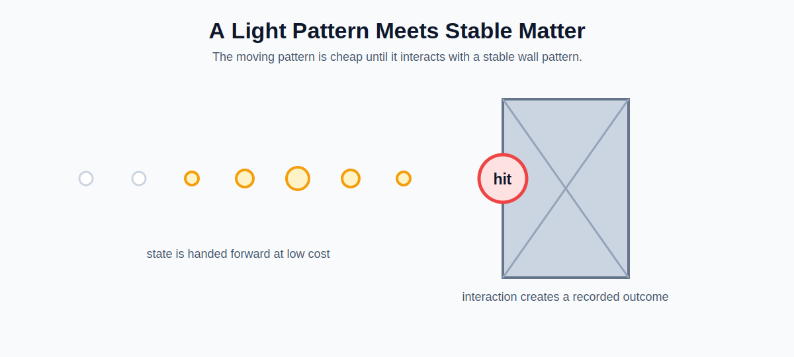

1. A light-pattern is handed from one update point to the next.
2. Because light is cheap motion, the pattern moves at the fastest allowed update speed.
3. While traveling, the pattern may keep several possible paths open.
4. The wall is a large stable pattern that strongly resists being overwritten.
5. When the light-pattern reaches the wall-pattern, the local update points cannot keep every possible interaction open for free.
6. The interaction creates a recorded outcome.
7. The light-pattern is absorbed, reflected, scattered, or transformed into another local change.

This one example shows the whole model in miniature.

Motion is pattern handoff.  
Matter is stable memory.  
Interaction has a cost.  
Collapse is a narrowing of open possibility.  
A recorded event is a stable update that remains in the world.

Nothing mystical has to happen.

The system simply reaches a point where keeping all possibilities open is more expensive than settling into one physical result.

---

## 17. Gravity Is a Change-Cost Gradient

Gravity is usually described as the bending of spacetime.

Finite Possibility Mechanics describes it in a different language:

> Gravity is what happens when motion bends toward lower-cost changes.

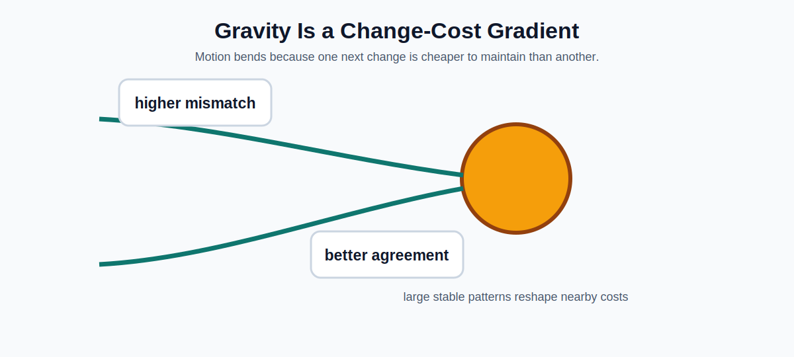

A large object, like a planet or star, is a huge stable memory pattern. Because it is stable and persistent, it changes the update costs around it.

Why would moving toward a large stable pattern be lower-cost?

Because nearby changes that line up with a large stable pattern have more agreement with what is already there. Moving away from it means maintaining a sharper mismatch against a huge settled structure. Moving toward it lets nearby updates fit into the existing pattern more easily.

Nearby paths are no longer equal.

Some changes become cheaper than others.

So motion bends.

Objects do not fall because an invisible hand pulls them. They fall because motion naturally bends toward changes that cost less to maintain.

In this model:

> Mass changes the cost of nearby changes, and that change-cost difference looks like gravity.

---

## 18. Time Is the Order of Updates

In this model, time is not just a background stage.

Time is the fact that the universe updates step by step.

One moment happens.  
Then the next moment happens.  
Then the next.

The order matters because each update changes what future updates can afford.

If a system spends energy now, it has less freedom later. If it stores a memory now, that memory affects what it expects later.

That means the past is not just gone. The past is written into the structure of the present.

This gives us another rule:

> Time is the trail left by a finite system updating itself.

The future is open only where the universe can still afford openness.

There is a deeper point too:

> The order of events is not free to rearrange.

If a system has no memory, reversing a process might seem simple. But a system with memory is different. Each step changes the budget, changes the stable patterns, and changes what the next step can afford.

That means running the same events backward is not just "the same movie in reverse." It is a different physical workload.

Imagine baking bread. Flour, water, yeast, and heat create a loaf. But the loaf does not naturally turn back into separate flour, water, yeast, and heat. The process wrote history into the structure.

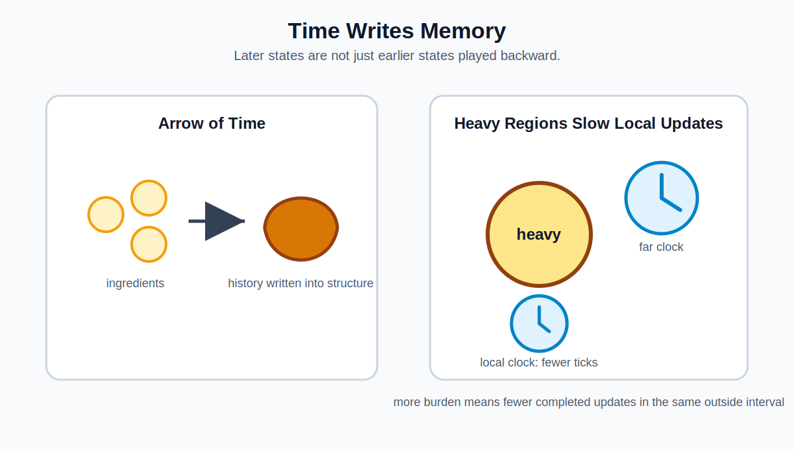

Finite Possibility Mechanics says time has a direction for a similar reason:

> Once energy has been spent and memory has formed, the later state is not equivalent to the earlier state.

When normal event order is compared against reversed and shuffled order, the reversed order carries about **8.83%** extra overhead, and the shuffled order carries about **17.67%** extra overhead.

The plain-language meaning is simple:

> History is not decorative. History changes the cost of what can happen next.

---

## 19. Heavy Regions Make Local Clocks Run Slower

If time is the order of updates, then time can slow down when updates become harder.

A heavy region is a region with a lot of stable pattern-cost.

Near a huge matter-pattern, like a planet or star, local updates carry more burden. There is more agreement to preserve, more structure to maintain, and more change cost around every motion.

That means fewer local changes can be completed for the same outside interval.

From far away, this looks like a clock running slower.

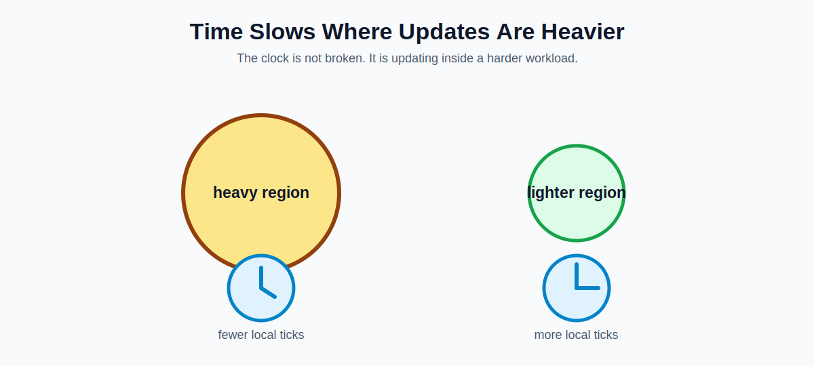

The clock is not broken. It is updating inside a heavier workload.

This gives a plain-language version of time slowing:

> Heavy regions make local clocks run slower because local updates cost more.

This is one of the places where the model tries to connect everyday time, gravity, and information cost into one picture.

---

## 20. Entanglement Means Shared State

Quantum entanglement sounds mysterious because it seems like two far-away things communicate instantly.

Finite Possibility Mechanics explains it differently:

> Entangled particles are not sending messages faster than light. They are two visible ends of one shared underlying state.

Imagine two screens showing the same live document. If the document changes, both screens show the change. The screens did not send a secret message to each other. They were both reading the same source.

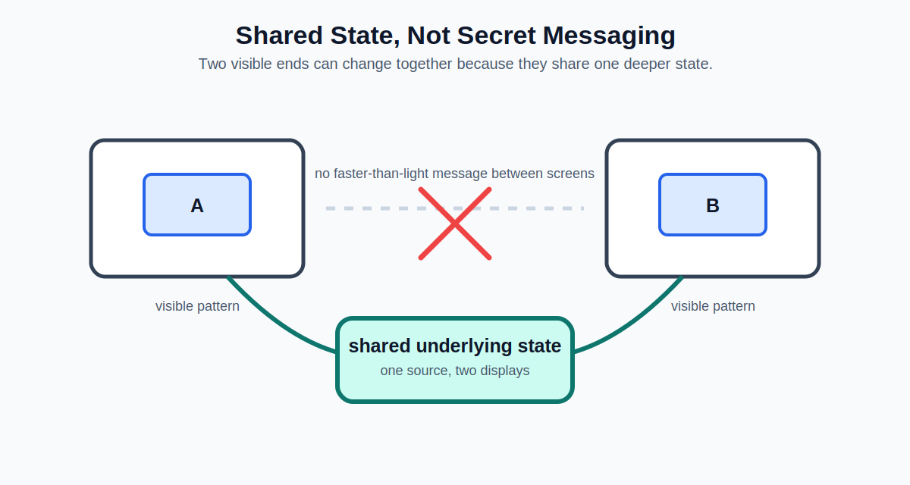

Entanglement may work like that.

Two particles can look separate in space, but still be tied to one shared state in the deeper update system.

This is not the same as saying each particle secretly carried a prewritten answer from the beginning. That would be a hidden-variable shortcut, and it does not capture what makes entanglement strange. The claim here is different: the two visible particles may be separate local appearances of one deeper pattern that has not fully split into independent states.

When one side becomes definite, the shared state becomes definite. The other side does not need to receive a signal across space, because it was never fully independent in the first place.

This gives us a simple rule:

> Entanglement is shared state, not faster-than-light messaging.

This does not mean distance is fake. It means distance belongs to moving patterns, while shared state belongs to the deeper structure that those patterns come from.

---

## 21. Are We All One Thing?

In one sense, yes.

This model says everything is part of one connected update system.

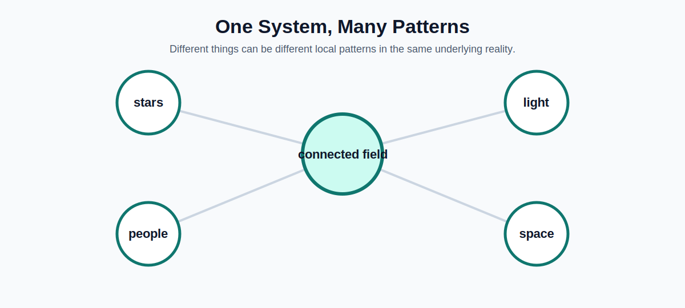

Stars, planets, people, light, and empty space are not made from totally different kinds of existence. They are different patterns in the same underlying system.

But this does not mean everything is the same in an everyday sense.

A person is not the same local pattern as a rock.  
A star is not the same local pattern as a thought.  
A photon is not the same local pattern as a planet.

They are different shapes of the same deeper process.

So the careful version is:

> Reality is one system, but that one system can form many stable local patterns.

This is why the model can say both things at once:

Everything is connected at the deepest level.  
Local things are still real.

---

## 22. Life as a Budget-Positive Pattern

Life is not treated as magic in this model.

A living thing is a pattern that keeps maintaining itself.

But maintenance costs energy.

Cells repair themselves. Bodies regulate heat. Brains update predictions. Organisms search for food, avoid damage, and rebuild what breaks.

All of that costs energy.

So the plain rule is:

> A living pattern survives when it takes in more usable energy than it spends maintaining itself.

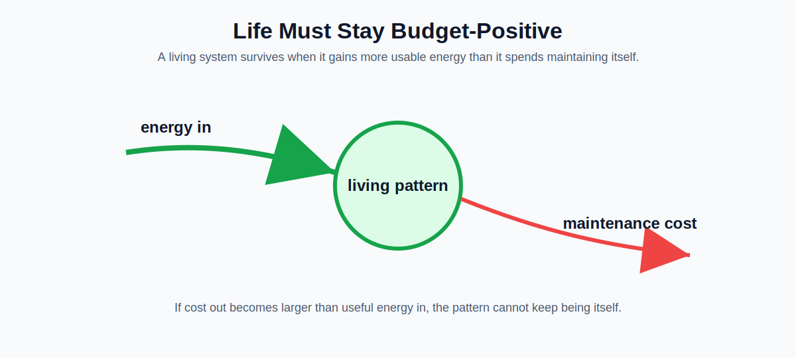

If the pattern keeps earning enough budget, it can stay flexible, repair damage, and adapt.

If it spends more than it can take in, it loses flexibility. It simplifies, breaks down, or dies.

In this model, life is a special kind of stable pattern:

> Life is stability that must keep paying for itself.

---

## 23. Cooperation Saves Energy

If wrong expectations cost energy, then shared information can be useful.

Two nearby patterns can sometimes lower their total cost by matching each other better.

That is the plain version of cooperation.

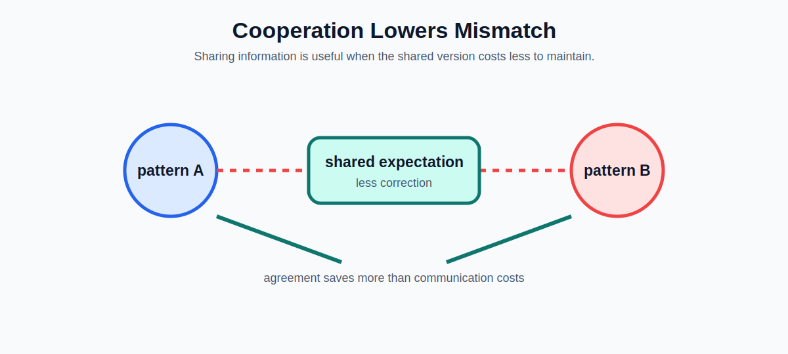

Cooperation does not have to mean kindness or intention. It can mean:

> Two patterns share or align information because the shared version costs less to maintain than the conflicting version.

For example, if neighboring update points are constantly correcting disagreement, they waste budget.

If they settle into a shared expectation, the mismatch drops.

The result is easier to maintain.

This gives a simple rule:

> Communication is useful when it reduces more cost than it creates.

If sharing information costs more than it saves, the system will not benefit from it.

If sharing information lowers mismatch, cooperation becomes physically useful.

---

## 24. Decay and Instability

Not every pattern can last.

Some patterns are stable because they are cheap enough to maintain.

Other patterns are temporary because they are too expensive, too strained, or too exposed to noise.

In this model, decay happens when a pattern can no longer pay the cost of staying itself.

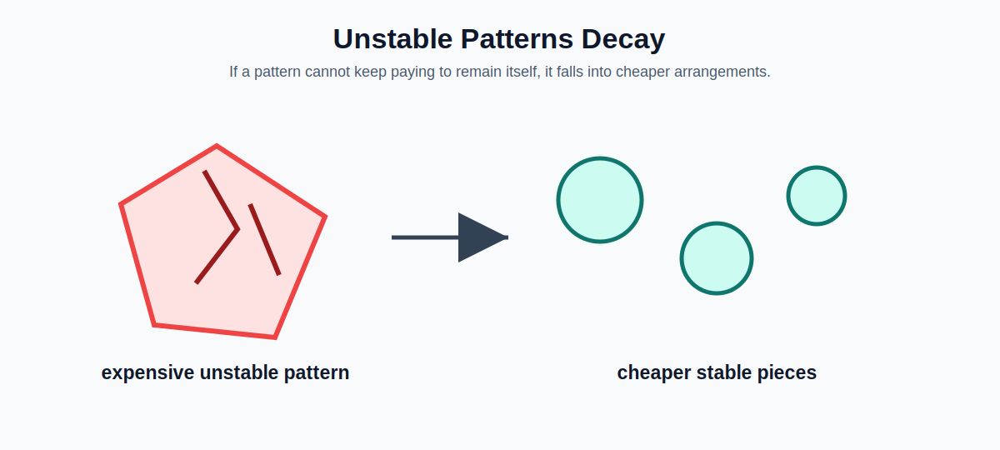

It may hold together for a while. It may look real and stable for a short time. But if the cost remains too high, eventually the pattern breaks into cheaper patterns.

This gives a simple rule:

> Unstable things decay because their current pattern is too expensive to keep maintaining.

Decay is not random magic.

It is the failure of an expensive structure under finite budget and disturbance.

---

## 25. Confinement

Some patterns are hard to pull apart.

At first, that seems strange. If two things are bound together, why not just separate them?

In Finite Possibility Mechanics, the answer is cost.

Some bound patterns become more expensive as you try to separate them. Pulling them apart does not simply move two pieces away from each other. It stretches the whole relationship between them.

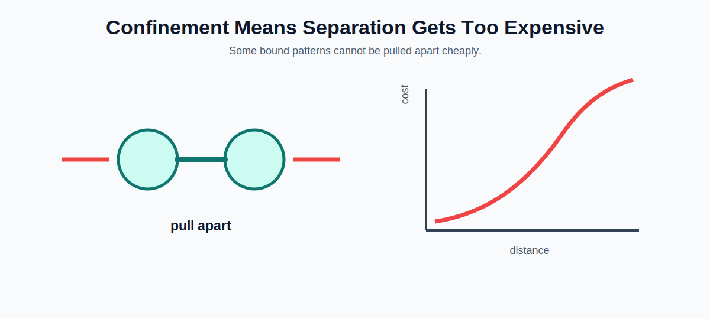

The farther apart they are forced, the more change cost builds up.

At some point, separating them may cost more than creating a new stable arrangement.

This gives a plain version of confinement:

> Some things stay bound because pulling them apart raises change cost faster than the system can afford.

Confinement means the relationship is part of the pattern.

You are not just moving objects.

You are trying to rewrite the structure that makes them what they are.

---

## 26. Extreme Wells Are Not Infinite

Some regions may be extremely hard to escape.

A black-hole-like region would be a place where change costs are so steep that nearly every local path bends inward or stays trapped.

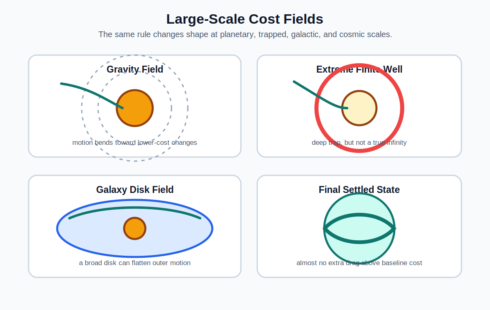

But this model is cautious about infinities.

It does not need a truly infinite pit.

It only needs an extremely deep finite well: a region where escape is possible in principle, but so costly that ordinary patterns cannot do it.

This gives a simple rule:

> The model prefers extreme-but-finite traps, not infinite holes.

That matters because infinities often signal that a model has reached the edge of its own language.

Finite Possibility Mechanics is built around finite budgets, finite updates, and finite change costs.

So even its most extreme objects should still be understood as bounded structures.

---

## 27. What This Model Is Not Saying

This model can easily be misunderstood, so this section matters.

It is not saying planets are files on a laptop.

It is not saying the universe is running on a human computer.

It is not saying there must be a programmer outside reality.

It is not saying physical objects are imaginary.

It is not saying your body, the Earth, or other people are fake.

It is not saying the universe has goals, intentions, emotions, or consciousness.

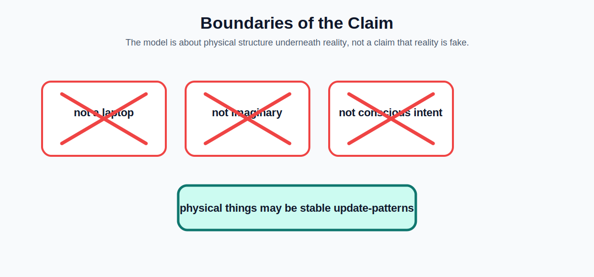

It is saying physical things may be stable update-patterns at the deepest level.

In everyday life, objects are real. Tables are real. Stars are real. Your hand is real.

The claim is about what reality may be made of underneath the everyday level.

This document is the plain-language version of the model. The equations, simulations, predictions, and comparisons to known physics are the mathematical layer underneath this explanation.

---

## 28. How the Math Touches Measurement

Finite Possibility Mechanics is not only a metaphor about patterns.

The model has a way to connect its hidden update picture to ordinary measurements like seconds, meters, joules, mass, and gravity.

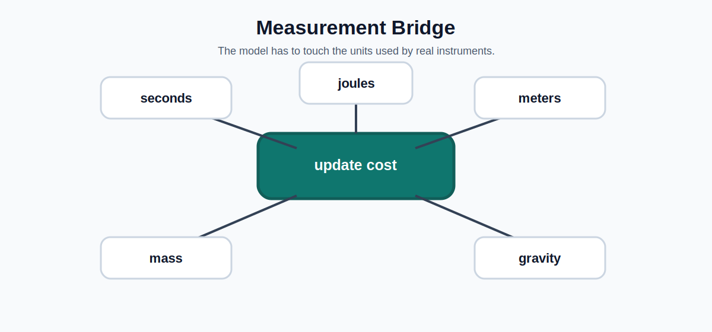

The bridge starts with one idea already introduced earlier:

> Information has a physical price.

If changing or erasing information costs energy, then an update budget can be connected to real energy. Real energy is measured in **joules**.

Once the model has joules, it can also connect to mass, because physics already links mass and energy.

The simple version is:

> A stable pattern has a change cost. That change cost can be translated into energy. Energy can be translated into mass.

This is why mass is not treated as a separate mystery in this model.

Mass is the physical weight of a stable pattern's cost.

The model also connects update distance and update time to the speed of light.

If one update step is the fastest possible local change, then the largest distance covered per update has to match the speed limit of the universe: **light speed**.

That gives the model a way to talk about **meters** and **seconds** instead of only abstract update steps.

In the current calibration, the universal update tick is about:

> **0.00000000000000000000001152 seconds**

That is roughly **1.152 x 10^-23 seconds**.

The matching update distance is about:

> **0.00000000000000345 meters**

That is roughly **3.45 femtometers**, which is a subatomic distance.

These numbers matter because they mean the model is not floating in imaginary units. It has a way to touch the scale of real particles and real measurements.

The same calibration also places the electron-scale pattern close to the known electron energy scale. The mass-scale result lands within about **1.97%** of the electron mass.

Gravity also fits into the same bridge.

The model treats gravity as motion through a change-cost gradient. To connect that idea to ordinary physics, the calibration uses the relationship between light speed, quantum action, and the Planck mass to close the value of the gravitational constant.

That gives:

> **G is about 6.674 x 10^-11 m^3 kg^-1 s^-2**

That is the familiar size of Newton's gravitational constant.

So the measurement bridge has four jobs:

1. Connect update budget to **joules**.
2. Connect update distance and update time to **meters** and **seconds**.
3. Connect stable pattern cost to **mass**.
4. Connect change-cost gradients to **gravity**.

This is why the model is not just a story about possibility.

It is a physical picture with a measurement scale.

---

## 29. Galaxy Rotation

Galaxies are not shaped like single round objects.

Many spiral galaxies are more like huge flat disks.

That matters because a disk spreads change cost differently than a sphere.

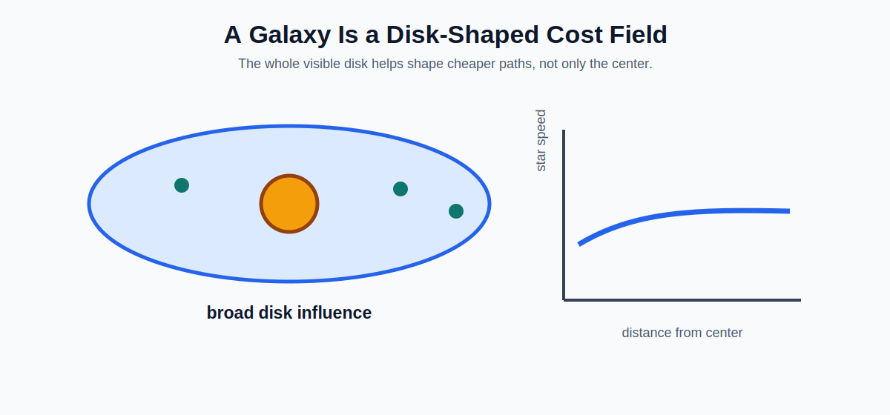

Near a round object, gravity-like change cost can fall away in a familiar steep pattern. But inside a wide disk, the cost field spreads sideways through the disk.

In plain language:

> A disk-shaped memory pattern can keep influencing motion farther outward than a simple ball-shaped pattern would.

This matters for galaxy rotation.

In many galaxies, stars far from the center move faster than simple visible-matter gravity seems to predict.

Finite Possibility Mechanics explains this by saying that the whole disk is part of the cost structure.

The visible matter in the disk does not only pull like a point in the center. It helps shape a broad change-cost sheet across the galaxy.

Inside that sheet, the cheapest paths for stars can stay nearly balanced over a long distance.

That makes the outer rotation curve flatter.

So the model's plain claim is:

> Galaxy rotation can be affected by the disk-wide change-cost pattern created by visible matter.

This does not require the galaxy to become a different kind of physics.

It is the same rule again:

> Patterns move along cheaper changes.

The difference is scale and shape. A galaxy is not a particle. A galaxy is a giant disk-shaped pattern, so its cost field has disk-shaped behavior.

---

## 30. The Final Settled State

If the universe has a finite budget, then it cannot keep wasting energy forever.

Over time, expensive open possibility tends to collapse into cheaper stable memory.

This raises a huge question:

> What happens if this settling process keeps going for an extremely long time?

Finite Possibility Mechanics points toward a final kind of state where almost every unnecessary cost has been removed.

In that state:

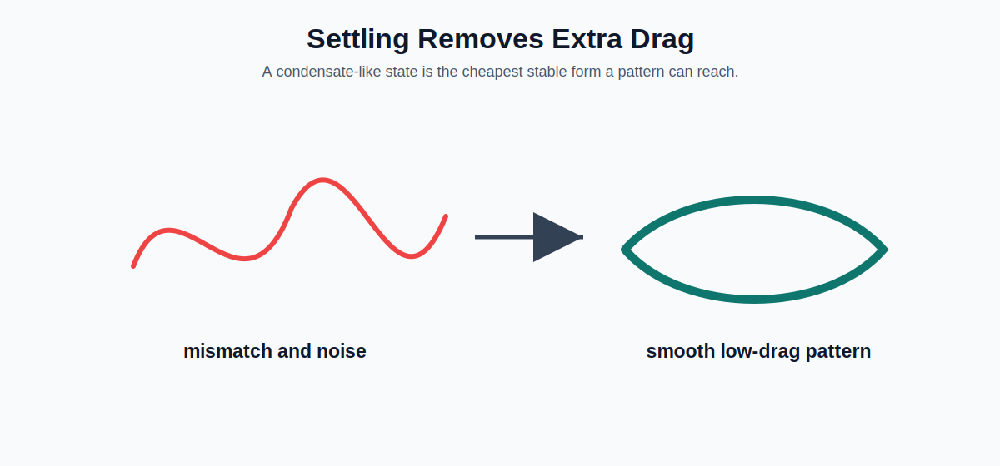

1. Open possibility has mostly collapsed.
2. Mismatch has mostly disappeared.
3. Random disturbance has faded.
4. The pattern has become extremely stable.
5. Updates continue only at the lowest unavoidable baseline cost.

This can be imagined like a perfectly smooth current.

Nothing is fighting itself.

Nothing is constantly correcting errors.

Nothing is wasting energy on unnecessary alternatives.

The technical name for a state like this is a **condensate-like state**.

For this paper, the simple meaning is enough:

> A condensate-like state is what a pattern becomes when it has settled into the cheapest stable form it can reach.

This does not mean "nothing exists."

It means the opposite: the pattern is so settled that it has almost no extra drag left.

In this model, the far future of the universe may be pulled toward that kind of deep stability.

The same idea appears at every scale:

> When the budget gets tight, reality stops paying for unnecessary possibility.

---

## 31. What Would Prove It Wrong?

A good model must be able to fail.

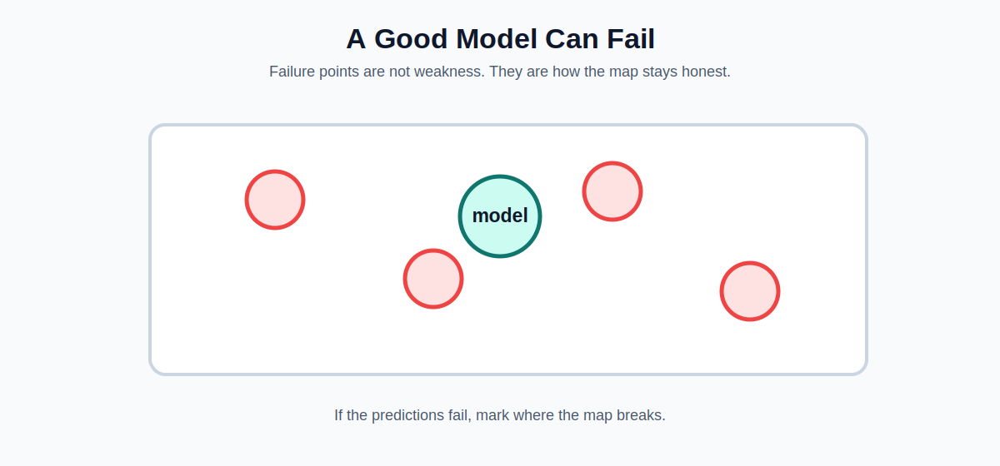

Finite Possibility Mechanics should not be protected from criticism. If it explains everything no matter what happens, then it explains nothing.

Things that would challenge this model include:

1. If possibility can stay open forever without any cost.
2. If information processing has no physical energy cost.
3. If quantum collapse has nothing to do with energy, interaction, or recording cost.
4. If gravity cannot be described in any way as motion through a change-cost gradient.
5. If stable matter does not behave like information that resists being overwritten.
6. If the order of events turns out not to matter for how physical systems evolve.
7. If the model cannot produce predictions beyond familiar digital-physics ideas.
8. If its predictions cannot be connected to measurements in ordinary physical units.
9. If the time-order overhead disappears under better tests.
10. If the gravity-like falloff cannot be reproduced outside a narrow artificial setup.
11. If the mass-scale calibration fails when tested against a wider particle set.
12. If information processing turns out to have no unavoidable physical cost.
13. If living systems cannot be described as budget-positive self-maintaining patterns.
14. If unstable patterns do not decay toward cheaper arrangements under finite budget.
15. If bound patterns can always be separated without rising change cost.
16. If black-hole-like regions require true infinities rather than extreme finite wells.
17. If disk-shaped galaxy cost fields cannot reproduce the broad flattening seen in galaxy rotation.
18. If the condensate-like final state cannot be reached even when mismatch, noise, and unnecessary possibility are driven toward zero.

The model does not need to be treated as sacred.

It should be treated as a map.

If the map helps explain reality, keep improving it. If the map fails, mark where it fails.

---

## 32. Important Words in Plain Language

Here are the main words without the fog:

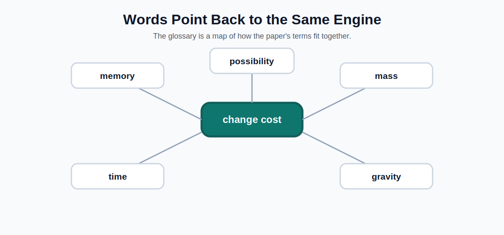

**Update point:** One tiny location in the universe's hidden update grid.

**State:** What an update point is currently holding: possibility, certainty, energy, memory, and pattern.

**Change cost:** The price of updating from one state into another.

**Path choice:** Choosing which nearby update point should hold a moving pattern next, or choosing which pattern is cheapest to maintain.

**Information cost:** The physical price of changing, recording, correcting, or erasing information.

**Calibration:** Connecting the model's internal ideas to real measurements like seconds, meters, joules, masses, and gravity.

**Universal update tick:** The model's proposed smallest natural update interval, about **1.152 x 10^-23 seconds**.

**Universal update distance:** The model's proposed smallest natural update distance, about **3.45 femtometers**.

**Energy budget:** How much freedom a local pattern has before it must simplify.

**Possibility:** Open outcomes that have not yet become definite.

**Memory:** A stable pattern that is cheaper to reuse than to recalculate.

**Agreement:** How well nearby update points fit together.

**Collapse loop:** The feedback cycle where low budget reduces open possibility, reduced possibility settles into memory, and memory makes the pattern harder to change.

**Wrong expectation:** A local pattern prepared for the wrong next state. It costs energy because the system has to correct the mismatch.

**Matter:** Stable memory-like information that resists change.

**Mass:** The physical expression of how costly a stable pattern is to hold together or redirect.

**Layering:** The way matter forms shells or levels because attraction, crowding, and change cost have to balance.

**Light:** Cheap moving information.

**Gravity:** Motion bending toward lower-cost changes.

**Galaxy cost field:** A broad disk-shaped change-cost pattern that can keep influencing star motion far from a galaxy's center.

**Time:** The order in which the update system changes.

**Time slowing:** The idea that heavy regions complete fewer local updates because nearby changes carry more burden.

**Entanglement:** Two visible patterns sharing one deeper state.

**Life:** A self-maintaining pattern that survives by taking in more usable energy than it spends.

**Cooperation:** Pattern alignment that saves more energy than it costs.

**Decay:** The failure of an expensive unstable pattern to keep maintaining itself.

**Confinement:** A binding condition where pulling patterns apart raises change cost faster than the system can afford.

**Extreme well:** A very deep but finite trap where escape is possible in principle but too expensive for ordinary patterns.

**Condensate-like state:** A deeply settled pattern with almost no extra drag beyond its lowest unavoidable cost.

**Synchronous update:** The idea that each new moment is produced from the previous moment as a whole, like a full-frame refresh.

---

## 33. The Simplest Summary

Finite Possibility Mechanics can be summarized like this:

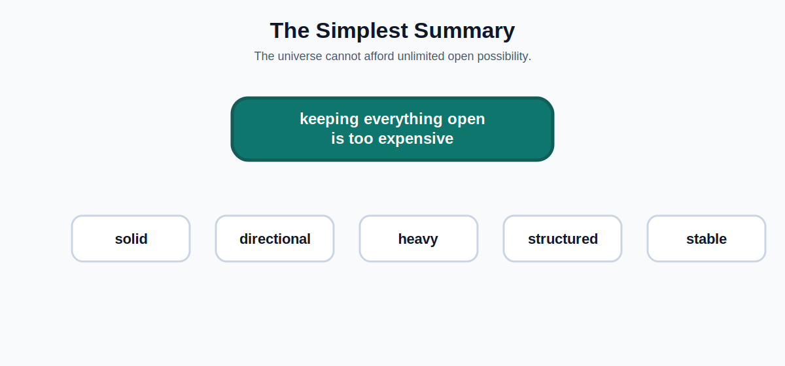

1. The universe has finite energy and finite processing capacity.
2. Reality updates through tiny local update points.
3. What moves is not solid stuff, but patterns of state.
4. Every possible next state has a change cost.
5. Change cost is the shared ledger behind collapse, gravity, mass, time slowing, decay, and stability.
6. Information is not free: changing, recording, correcting, and erasing it have physical cost.
7. Keeping many possibilities open costs energy.
8. When energy is limited, possibility collapses into stable memory.
9. Collapse is a feedback loop: low budget reduces possibility, and reduced possibility settles into memory.
10. Matter is compressed, stable information that resists being overwritten.
11. Mass is the cost of holding or redirecting a stable pattern.
12. Matter forms layers when attraction, crowding, and change cost balance.
13. Wrong expectations cost energy because mismatch must be corrected.
14. Large matter-patterns change the cost of nearby motion.
15. Light is low-cost moving information.
16. Quantum wave behavior means multiple possibilities stayed open.
17. Recorded outcomes appear when open possibility becomes too expensive to maintain.
18. A light hitting a wall is a cheap moving pattern interacting with a stable memory pattern.
19. Gravity is motion through change-cost gradients.
20. Time is the order in which the universe updates, and history changes what later updates cost.
21. Heavy regions make local clocks run slower because local updates cost more.
22. Entanglement is shared state, not faster-than-light messaging.
23. Life is a pattern that must stay budget-positive.
24. Cooperation is useful when shared information saves more energy than it costs.
25. Unstable patterns decay when they cannot keep paying to remain themselves.
26. Some patterns stay confined because separation raises change cost too sharply.
27. Extreme traps should be finite wells, not true infinities.
28. Reality is one connected system forming many local patterns.
29. The model connects update cost to real measurements like joules, seconds, meters, mass, and gravity.
30. Galaxy rotation can be shaped by broad disk-like change-cost fields.
31. A final settled state would be a pattern with almost no extra drag beyond its lowest unavoidable cost.
32. Reality is what the universe can afford to keep physically maintaining.

The deepest summary is:

> The universe becomes solid, directional, heavy, time-slowed, structured, and stable because keeping everything open is too expensive.
